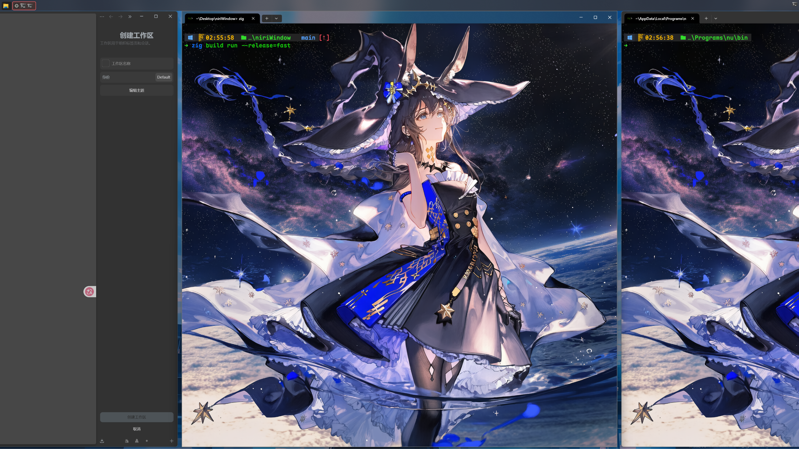

# niri4win

niri4win 是一个用 [Zig](https://ziglang.org/) 编写的 **Windows 平铺窗口管理器**。它在屏幕顶部显示一个 AppBar 任务栏，提供基于列的窗口平铺布局，并深度集成 Windows 10/11 的虚拟桌面功能。渲染管线基于 Direct2D 硬件加速，支持亚克力（Acrylic）半透明背景效果。



## 功能特性

- **列式平铺布局** — 窗口按列并排排列，铺满整个桌面工作区
- **虚拟桌面集成** — 通过 COM 接口操控 Windows 内置虚拟桌面，支持创建/切换/移动窗口到指定桌面
- **全局快捷键** — 低级键盘钩子（Low-Level Keyboard Hook），支持多修饰键组合
- **Acrylic 渲染** — 自绘亚克力材质背景（壁纸模糊 + 色调混合 + 噪声纹理），硬件加速渲染
- **可配置过滤规则** — 按类名/标题/进程路径排除不管理的窗口
- **工作区切换** — 支持 1\~9 编号工作区的快速切换与窗口迁移
- **全屏检测** — 自动识别 DX 全屏独占和边框全屏，动态隐藏 AppBar

## 系统要求

- Windows 10 1809+ 或 Windows 11

## 构建

### 依赖

- Zig  0.16.0

### 编译

```bash
zig build
```

编译产物位于 `zig-out/bin/niri4win.exe`。

### 运行

```bash
zig build run
```

通过cwd读取`配置,` 需要注意`conf位置. logging.conf 用于日志过滤, config.conf 用于 快捷键配置和窗口过滤`

## 配置

### config.conf

release下配置文件位于 EXE 同级目录，分为以下节：

#### \[class] / \[title] / \[path] — 窗口过滤

这些节中的条目用于排除不参与平铺管理的窗口：

```ini
[class]
Windows.UI.Core.CoreWindow
ApplicationFrameWindow

[title]
Game Bar
任务管理器

[path]
SystemApps
```

- `[class]` — 按窗口类名过滤
- `[title]` — 按窗口标题过滤（子串匹配）
- `[path]` — 按进程路径过滤（子串匹配）

#### \[hotkey] — 快捷键绑定

格式为 `修饰键+按键 = 动作`，修饰键支持 `Alt`、`Ctrl`、`Shift`、`Win`（多个用 `+` 连接）：

```ini
[hotkey]
Alt+Q = close_window
Alt+Left = focus_left
Ctrl+1 = focus_column_1
```

### logging.conf

可选文件，用于控制日志模块的屏蔽：

```ini
[banned]
VirtualDesktop
Hotkey
```

被列入 `[banned]` 节的模块不会输出日志。

## 快捷键参考

### 窗口管理

| 快捷键           | 动作     |
| ------------- | ------ |
| `Alt+Q`       | 关闭当前窗口 |
| `Shift+Alt+Q` | 退出程序   |

### 聚焦与移动

| 快捷键                                  | 动作           |
| ------------------------------------ | ------------ |
| `Alt+Left` / `Alt+Right`             | 聚焦左侧/右侧列     |
| `Alt+Shift+Left` / `Alt+Shift+Right` | 列左移/右移       |
| `Ctrl+1~9`                           | 聚焦当前工作区第 N 列 |

### 宽度与全屏

| 快捷键     | 动作            |
| ------- | ------------- |
| `Alt+=` | 增加列宽 (+150px) |
| `Alt+-` | 减少列宽 (-150px) |
| `Alt+F` | 切换全屏          |

### 工作区

| 快捷键                               | 动作              |
| --------------------------------- | --------------- |
| `Alt+Up` / `Alt+Down`             | 切换到上一个/下一个工作区   |
| `Alt+Shift+Up` / `Alt+Shift+Down` | 移动窗口到上一个/下一个工作区 |
| `Alt+1~9`                         | 切换到指定工作区        |
| `Alt+Shift+1~9`                   | 移动窗口到指定工作区      |

## 项目结构

```
niri4win/
├── build.zig                 # 构建脚本
├── build.zig.zon             # 包元数据 / 依赖声明
├── config.conf               # 主配置文件
├── logging.conf              # 日志过滤配置
├── src/
│   ├── main.zig              # 程序入口
│   ├── app.zig               # 核心应用逻辑（消息循环 / 动作处理）
│   ├── config.zig            # 配置文件解析
│   ├── logger.zig            # 自定义日志（时间戳 / 彩色 / 模块过滤）
│   ├── types.zig             # 公共类型定义
│   ├── com.zig               # COM 工具函数
│   ├── desktop/
│   │   ├── manager.zig       # 虚拟桌面管理器
│   │   └── virtual_desktop.zig # IVirtualDesktop COM 接口定义
│   ├── input/
│   │   ├── hotkey_manager.zig # 快捷键管理（LL Hook）
│   │   └── std_input.zig     # 标准输入读取
│   ├── tiling/
│   │   └── manager.zig       # 平铺布局引擎
│   ├── ui/
│   │   ├── app_bar.zig       # AppBar 注册 / 定位
│   │   ├── d2d.zig           # Direct2D 渲染（D3D11 + D2D + Acrylic）
│   │   └── task_bar.zig      # 窗口可管理性检测 / 图标提取
│   └── tools/
│       └── overflow.zig      # 系统托盘溢出窗口定位工具
└── zig-out/
    └── bin/
        ├── niri4win.exe
        └── config.conf
```

## 依赖

- [zigwin32](https://github.com/marlersoft/zigwin32) — Windows API 的 Zig 绑定

## 未来计划

- **MSIX 格式打包** — 使用 MSIX 格式进行发布包分发
- **配置文件规范化** — 将配置文件迁移至标准的 `%AppData%` 目录下
- **系统托盘 & Dock 栏 &App Launcher — 实现系统托盘图标和 Dock 栏功能，支持在隐藏 Windows 任务栏时提供替代的启动器/任务切换体验
- **更好的模糊实现** - 当前会受到wallpaper的影响导致模糊异常,修复这个问题并且加入更多效果切换

## 许可证

本项目使用 [GPL-3.0](https://www.gnu.org/licenses/gpl-3.0.html) 许可证。
